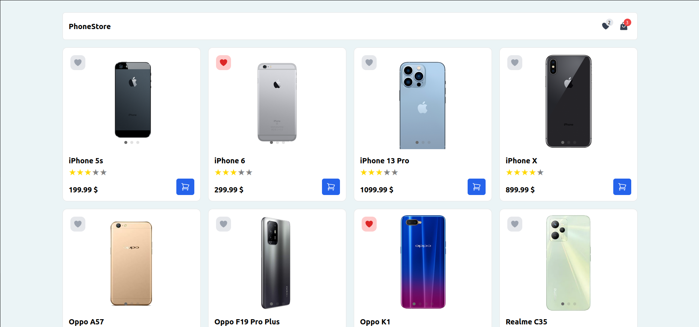

[Live Demo](https://react-phone-shopping-cart-redux.netlify.app/)

# React Phone Store Project

This project is a phone store application with dummyjson.com Products API information. Users can review their products, package the products they like and rate them.

## Features

 Product List: The bad list retrieved from the API is displayed on the home page.

 Add to Cart: Users can add their products to the cart. The cart is managed with Redux.

 Local Storage Integration: Cart information is kept using local storage (local storage) so users do not lose their carts when they reload.

 Responsive Design: The application is designed to suit different screen sizes.

## Used technologies

 - React
 - Redux toolkit
 - React Router DOM
 - React Rating Star Component
 - swiper
 - Tailwind CSS
 - Hero icons